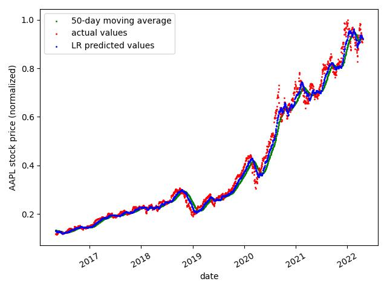
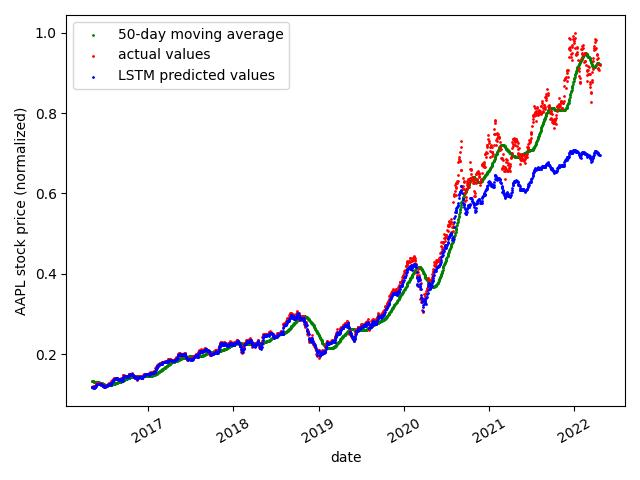
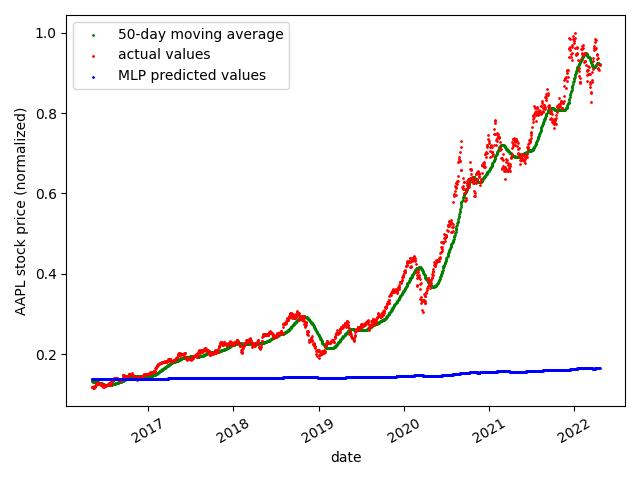

# stock-price-predictor

A suite of machine learning algorithms trained on historical data corresponding to the Apple stock (ticker: AAPL). Each model "analyzes" the previous 50 closing prices of a stock and predicts the next closing price.

## Disclaimer

- The predictions made by the machine learning algorithms implemented in this repository are not guaranteed to be accurate, truthful, or correct whatsoever
- They should not be considered or used when making any financial decision
- Predictions are not intended to act as financial advice in any means

## Implemented Machine Learning Algorithms

1. [Linear regression (LR)](/linear_regression.py)
   - implemented from scratch
2. [Long short-term memory (LSTM)](/lstm.py)
   - implemented using [TensorFlow Keras](https://www.tensorflow.org/api_docs/python/tf/keras)
   - recurrent artificial neural network
   - one lstm layer
3. [Multi-layer perceptron (MLP)](/multi_layer_perceptron.py)
   - implemented from scratch
   - fully connected feed-forward artificial neural network
   - one input layer
   - one hidden layer
   - one output layer

## Results

### LR

The results of the trained LR model on the test data can be seen in the image below.


### LSTM

The results of the trained LSTM model on the test data can be seen in the image below.


### MLP

The results of the trained MLP model on the test data can be seen in the image below.


## Dataset

The dataset used for training, validation, and testing was retreived from [Yahoo Finance](https://ca.finance.yahoo.com) via the [Yahoo Finance Python Package](https://pypi.org/project/yfinance/).

See [here](https://github.com/ryankortbeek/stock-price-predictor/blob/ec6bfb9da56ff8b3b476b1df7ca4e346a8568f37/util.py#L36) for how this is done.

## Loss Function

The loss function used in the implementation of all the models was [mean squared error](https://en.wikipedia.org/wiki/Mean_squared_error).

## Evaluation Metric

The metric used to evaluate all the models was [mean absolute difference](https://en.wikipedia.org/wiki/Mean_absolute_difference).

## Running Instructions

Ensure the following dependencies are installed.

- pandas
- numpy
- tensorflow
- matplotlib

Train and test the models with:

```
python3 main.py
```
